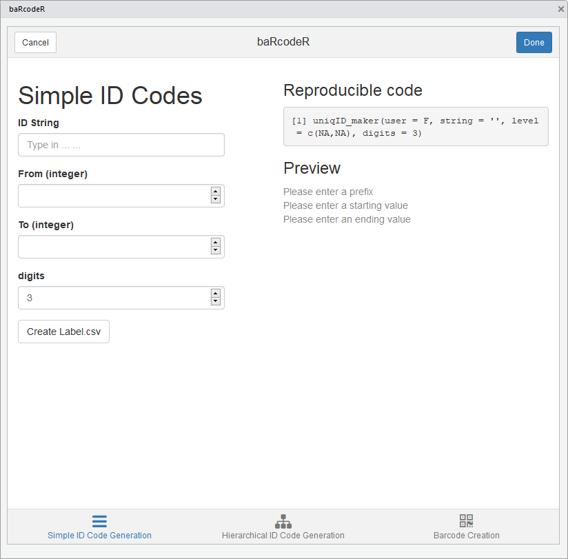

# baRcodeR

Yihan Wu and Robert I. Colautti

## Cheat Sheet

A 2-page, quick-reference guide is available via [Figshare](https://dx.doi.org/10.6084/m9.figshare.7043309)

## Overview


## Quick Start:

```
devtools::install_github("yihanwu/baRcodeR", build_vignettes = T)
library(baRcodeR)
```

## Introduction

`baRcodeR` is a R package for generating sample labels and 2D barcodes for labelling and tracking biological samples. Users can: 

* generate simple labels (Ex001, Ex002, Ex003 ...),
* generate hierarchical labels (A01-B01, A01-B02, A02-B01, A02-B02, A03-B01 ...),
* produce PDF files with custom layouts for all types of sticker labels.

## Usage the RStudio addin 


The main baRcodeR functions, label creation and barcode generation, can be performed interactive via the RStudio addin found on the toolbar. 



Click on the add-in, and a popup window will appear.


As you fill in the fields, a preview of the labels will appear on the side along with reproducible code which can be copied. A data frame will be produced containing the labels, the string, and the number in separate columns.  


You can switch from the simple label generation tab to the hierarchical label generation or barcode creation tabs at the bottom.

For hierarchical labels, the information for each level is saved under the "Hierarchy" section. The "Add level" button is used to add more levels to the hierarchy, and the "Remove level" button will remove the most recently added level. The data frame will contain labels in the first column, and level values in successive columns named by the string for the level. 

Labels are saved with the file name "Labels_YYYY-MM-DD.csv" in the working directory.


The Barcode Creation tab contains all the advanced options for page layout. A text file can be imported by clicking the "Browse" button and selecting a text file in the file browser. The file can be previewed by clicking "Import File". 


The first column is highlighted as default. Users can then preview font size, and layout options. We provide the ability to select the column to use for barcode generation. Users can choose the column by clicking on the data table. PDF options can be left as default and fine-tuned after seeing the initial PDF output. 

Barcode generation of hundreds of barcodes may take a few minutes, depending on the computer, and we have provided a text indicator for completion of the PDF file.


## Usage from the console

Please load the vignette "Using-baRcodeR" for console use.

```
library(baRcodeR)
vignette("Using-baRcodeR")
```

